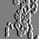

# Germs of Life
<-Conway's Game of Life
<-My *"Germs of Life"*

Since Conway's Game of Life is a cellular automata, my source of inspiration was in the name itself: `cells`. Living microscopic cells to be exact. Their chaotic unpredictable movements along with their ability to divide themselves through mitosis fit perfectly to Conway’s Game of Life.

To achieve the microorganisms sporadic behavior, I coded a 5 by 5 grid or 25 neighbors layout for more opportunities in GLSL for the cells to multiply as finding contact to another cell became more propable.

Next, I also wanted to make the visual more natural and living by adding distortion as well as embossing it to make it look like the cells are being viewed through a microscope.
